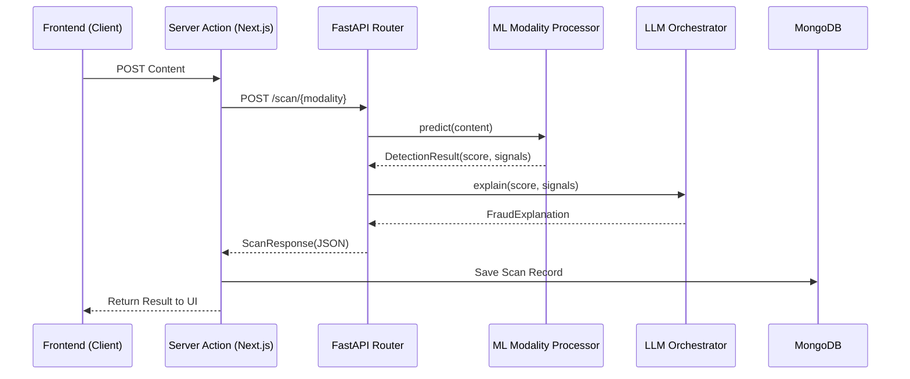

# System Architecture - ScamShield

This document provides a detailed view of the technical architecture, data flows, and component hierarchies of the ScamShield platform.

## 1. High-Level Architecture

ScamShield follows a microservice-inspired architecture where the Next.js frontend handles user interaction and persistence, while the FastAPI backend serves as a stateless detection engine.

### System Diagram

```mermaid
graph TB
    subgraph Frontend["Next.js App Router"]
        subgraph Pages["Pages"]
            Home["/ (Landing)"]
            Dashboard["/dashboard"]
            EmailPage["/scan/email"]
            URLPage["/scan/url"]
            FilePage["/scan/file"]
            AudioPage["/scan/audio"]
            PromptPage["/scan/prompt"]
            ReportPage["/report"]
        end

        subgraph Components["Scanners (Client Components)"]
            EmailScanner[EmailScanner]
            URLScanner[URLScanner]
            FileScanner[FileScanner]
            AudioScanner[AudioScanner]
            PromptScanner[PromptScanner]
        end

        subgraph UI_Lib["shadcn/ui"]
            Button[Button]
            Card[Card]
            Alert[Alert]
            Textarea[Textarea]
        end

        subgraph Services["Server Actions"]
            ScanAction[scan.actions.ts<br>performScan()]
            ReportAction[report.actions.ts<br>submitReport()]
        end

        subgraph DB["Database"]
            Mongoose[Mongoose Models<br>Scan, Report, User]
        end
    end

    subgraph Backend["FastAPI Microservice"]
        Router[API Router<br>app/api/v1/router.py]

        subgraph Processors["Detection Processors"]
            Email[Email Processor<br>DistilBERT + Heuristics]
            URL[URL Processor<br>BERT + Features]
            File[File Processor<br>Magic Bytes + Entropy]
            Audio[Audio Processing<br>Librosa + FFmpeg]
            Prompt[Prompt Processing<br>DeBERTa v3]
        end

        subgraph RiskEngine["Risk Analysis Engine"]
            Aggregator[Risk Aggregator<br>Weighted Average]
            ReportService[Report Heuristic Service<br>Community Index]
        end

        subgraph LLM_Service["LLM Orchestration"]
            Orchestrator[LLM Orchestrator<br>LangChain + Ollama]
        end
    end

    subgraph External["External Services"]
        Ollama[Ollama API<br>qwen2.5:0.5b]
        HuggingFace[Hugging Face Hub<br>Model Weights]
    end

    EmailScanner --> ScanAction
    URLScanner --> ScanAction
    FileScanner --> ScanAction
    AudioScanner --> ScanAction
    PromptScanner --> ScanAction

    ScanAction --> Backend
    ScanAction --> DB

    Router --> Email
    Router --> URL
    Router --> File
    Router --> Audio
    Router --> Prompt

    Email --> Aggregator
    URL --> Aggregator
    File --> Aggregator
    Audio --> Aggregator
    Prompt --> Aggregator

    Aggregator --> ReportService
    ReportService --> Orchestrator
    Orchestrator --> Ollama

    classDef primary fill:#f9f,stroke:#333,stroke-width:2px;
    classDef secondary fill:#bbf,stroke:#333,stroke-width:2px;
    class Router,Aggregator primary;
    class Orchestrator secondary;
```

## 2. Request Lifecycle & Data Flow

Every scan request traverses the system from the frontend UI to the backend ML pipeline and finally through an LLM enrichment layer.

### Sequence Diagram



## 3. Modality Analysis Pipelines

### 3.1 Email Analysis

- **Model**: `cybersectony/phishing-email-detection-distilbert_v2.1`
- **Logic**: Combines transformer classification with keyword-based heuristic boosting (urgency, credential harvesting).

### 3.2 URL Analysis

- **Model**: `darshan8950/phishing_url_detection_BERT`
- **Logic**: 65% ML weight / 35% Heuristic weight (IP detection, length checks, character analysis).

### 3.3 Audio Analysis

- **Engine**: Librosa Spectral Analysis
- **Features**: MFCC, Spectral Centroid, Bandwidth, Rolloff, ZCR, Spectral Flatness, Pitch variance.
- **Goal**: Detect deepfake audio through timbre and pitch stability anomalies.

### 3.4 Prompt Injection

- **Model**: `protectai/deberta-v3-base-prompt-injection-v2`
- **Labels**: SAFE, INJECTION, JAILBREAK.

## 4. Scalability & Deployment

- Stateless backend allowed for horizontal scaling with multiple worker instances.
- Docker containerization for both services and MongoDB.
- Local model weights persisted via Docker volumes.
